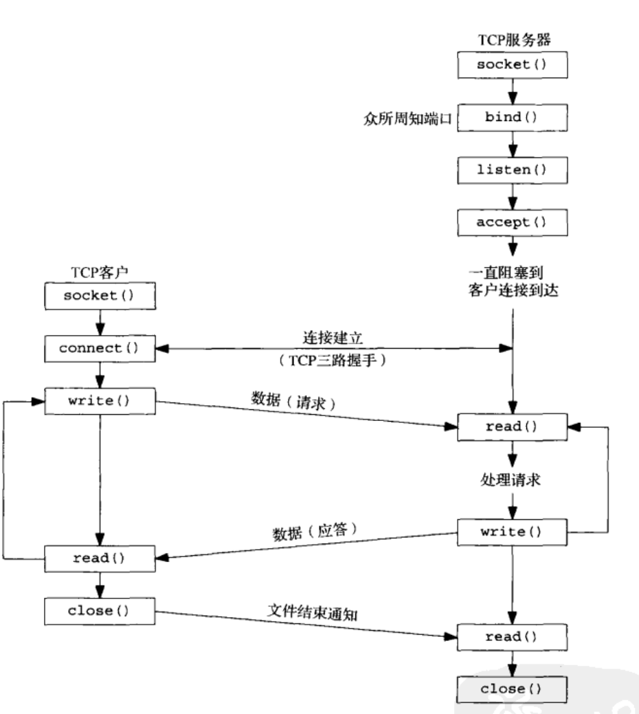

## 在root_dir编译过程
## just run this
```
aclocal
autoconf
automake  --add-missing
autoheader
glibtoolize

mkdir build
cd build
../configure && make
./bin/test

```

## imgs


## reactor https://www.cnblogs.com/doit8791/p/7461479.html
